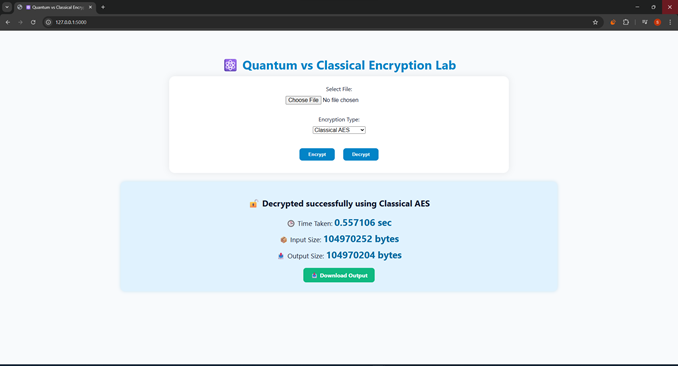

# Quantum vs Classical Encryption 🔐

A Python Flask-based web app that enables secure file encryption and decryption using AES (classical) and quantum encryption techniques.  
It compares both methods in terms of **speed**, **efficiency**, and **security**, demonstrating how quantum approaches can enhance modern cryptographic systems.

---

## ⚙️ App Preview

  

---

## 🚀 Features
- File-based encryption & decryption (AES & Quantum)
- Real-time speed comparison metrics
- Flask web interface with light & modern UI
- Performance logging using SQLite database
- Downloadable encrypted/decrypted files

---

## 🧩 Technologies Used
- **Python Flask**
- **AES (PyCryptodome)**
- **Quantum Simulation**
- **SQLite**
- **HTML / CSS (Modern UI)**

---

## 🧠 How It Works
1. Upload a file (e.g., PDF, text, or image).  
2. Choose encryption mode: **Classical AES**, **Randomized AES**, or **Quantum**.  
3. Compare metrics such as encryption time and efficiency.  
4. Download the output file securely.

---

## 📊 Future Enhancements
- Real quantum key distribution (QKD) simulation  
- Integration with real quantum hardware APIs (IBM Qiskit, etc.)  
- Visualization dashboards for metric trends  

---

## 📄 License
This project is open-source under the [Apache](LICENSE).

